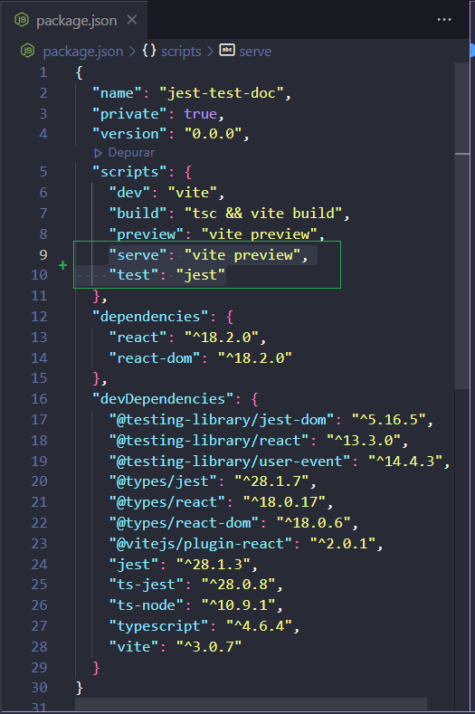
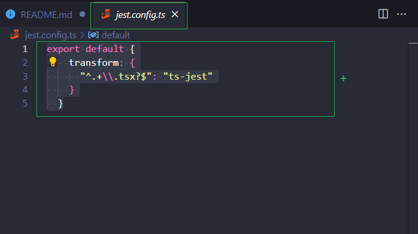
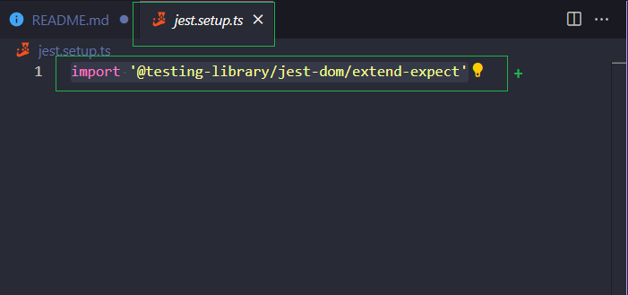

<h2>Guide installation and configuration jest in your project create with vite - react - typescript.</h1>

- First step {
  with yarn 1.22.19

        -install jest:
            yarn add jest -D
        -install jest types:
            yarn add @types/jest -D
        -install testing library:
            yarn add @testing-library/react -D
            yarn add @testing-library/user-event -D
            yarn add @testing-library/jest-dom -D
        -install ts-note and ts-jest:
            yarn add ts-node ts-jest -D

  }

- Second step {

          Configure package.json:
            Add this lines in scripts object.
                "serve": "vite preview",
                "test": "jest"
            In some cases, you need remove the object "type": "modules" in your package.json

  }

  

  Example package.json:  
  
  

- Third step {

          Create file in the root project:
              jest.config.ts
          Inside this file, insert this information:
              export default {
                  transform: {
                  "^.+\\.tsx?$": "ts-jest"
                  }
              }

  }
  

  Example jest.config.ts  
  
  

- Fourth step {

          Create file in the root project:
              jest.setup.ts
          Inside this file, insert this information:
             import '@testing-library/jest-dom/extend-expect'
          With this import, you not needed import again in all tests. This import is global for every tests

  }
  

  Example jest.setup.ts  
  
  

Now, create yours tests and test. 😂
